# 🐝 Autonomous Multi-Agent RCA Swarm using Valkey as a Shared Blackboard

[](https://valkey.io/)
[](https://ai.google.dev/)
[](https://www.docker.com/)
[](https://www.python.org/)

An autonomous, multi-agent Root Cause Analysis (RCA) demonstration showcasing **emergent stigmergic coordination** through an in-memory blackboard backed by **Valkey** (compatible with Google Cloud Memorystore for Valkey) and powered by real **Gemini 3.5 Flash** reasoning.

---

## 🎯 Architectural Overview

Rather than relying on a centralized, brittle hierarchical orchestrator passing huge context windows between agents, specialized workers run independently and coordinate **exclusively** through Valkey state changes:

```mermaid
flowchart TD
    subgraph Ingress Alert
        Alert["🚨 Alert (Ingress 504 / 502 / Latency)"]
    end

    subgraph Valkey In-Memory Blackboard
        Stream["stream:rca:events\n(Consumer Groups: agents-group)"]
        Timeline["rca:timeline\n(Sorted Set: score=timestamp)"]
        Hypotheses["rca:hypotheses\n(Hashes: id -> JSON spec)"]
        Confidence["rca:confidence\n(Sorted Set: score=[-100..100])"]
        Contributors["rca:hypothesis:id:contributors\n(Set: distinct agent IDs)"]
        Locks["lock:investigate:service:scope\n(String: SET NX EX)"]
        Steps["rca:agent:steps\n(List: Scratchpad Audit Log)"]
        Broadcast["rca:control:broadcast\n(Pub/Sub: TERMINATE)"]
        Verdict["rca:final_verdict\n(String: Markdown Post-Mortem)"]
    end

    subgraph Autonomous Agent Swarm
        TraceAgent["🔍 TraceExplorerAgent"]
        DBAgent["🗄️ DatabaseSleuthAgent"]
        DeployAgent["📦 DeployScoutAgent"]
        InfraAgent["☸️ InfraK8sAgent"]
        Synthesizer["⚖️ SynthesizerArbiter (Daemon)"]
    end

    Alert -->|XADD| Stream
    Stream -->|XREADGROUP / XAUTOCLAIM| TraceAgent
    Stream -->|XREADGROUP / XAUTOCLAIM| DBAgent
    Stream -->|XREADGROUP / XAUTOCLAIM| DeployAgent
    Stream -->|XREADGROUP / XAUTOCLAIM| InfraAgent

    TraceAgent -->|Lock & Trace Telemetry| Timeline
    TraceAgent -->|Proposes H1| Hypotheses
    TraceAgent -->|Initial Confidence 50| Confidence
    TraceAgent -->|Audit Step| Steps

    DBAgent -->|Audit DB Telemetry| Hypotheses
    DBAgent -->|Refutes H1: ZINCRBY -40| Confidence
    DBAgent -->|SADD| Contributors
    DBAgent -->|Audit Step| Steps

    DeployAgent -->|Audit Git Diffs| Hypotheses
    DeployAgent -->|Branches H2: Score 60| Hypotheses
    DeployAgent -->|SADD| Contributors
    DeployAgent -->|Audit Step| Steps

    InfraAgent -->|Audit Pod Metrics| Hypotheses
    InfraAgent -->|Corroborates H2: +30 -> 90| Confidence
    InfraAgent -->|SADD| Contributors
    InfraAgent -->|Audit Step| Steps

    Synthesizer -->|Consensus >= 85 with >= 2 contributors| Verdict
    Synthesizer -->|PUBLISH TERMINATE| Broadcast
    Broadcast -->|Graceful Shutdown| TraceAgent
    Broadcast -->|Graceful Shutdown| DBAgent
    Broadcast -->|Graceful Shutdown| DeployAgent
    Broadcast -->|Graceful Shutdown| InfraAgent
```



---

## 🎓 Why Valkey? 4 Multi-Agent Coordination Gaps Solved

| Multi-Agent Failure Mode | Naive Architecture (Without Valkey) | Valkey Blackboard Solution |
| :--- | :--- | :--- |
| **1. Token Explosion** | Megabytes of raw trace spans and metric dumps are concatenated into LLM prompts across agent turns, quickly exceeding token limits and causing cost balloons. | Agents store telemetry structures in **Valkey Hashes** (`rca:hypotheses`) and only pass lightweight 20-byte event IDs over **Valkey Streams**. |
| **2. Race Conditions & Duplicate Work** | Concurrent agents query the same telemetry providers (e.g. Cloud Trace, database metrics) simultaneously, multiplying latency and API costs. | **Atomic Single-Flight Distributed Locks** (`SET NX EX`) ensure only one agent inspects a telemetry provider at a time; others back off instantly. |
| **3. Central Bottleneck Orchestrator** | A monolithic supervisor directs all agent steps sequentially, creating an architectural single-point-of-failure. | **Stigmergic Coordination**: Workers subscribe to `stream:rca:events` via Consumer Groups (`XREADGROUP` / `XAUTOCLAIM`) and react autonomously to blackboard mutations. |
| **4. Echo-Chamber Hallucinations** | A single hallucinating agent validates its own hypothesis repeatedly across loop iterations, artificially inflating confidence. | **Valkey Sets** (`rca:hypothesis:<id>:contributors`) enforce unique agent tracking. The Synthesizer requires `SCARD >= 2` distinct specialist contributors before declaring consensus. |

---

## ⚡ Quickstart: Local Setup in Under 2 Minutes

### Prerequisites
1. **Docker** (Docker Desktop or Docker Engine): [Get Docker](https://docs.docker.com/get-docker/)
2. **Python 3.10+**: `python3 --version`
3. **Gemini API Key**: [Get a free key from Google AI Studio](https://aistudio.google.com/app/apikey)

### Step 1: Run the Automated Setup Script
```bash
git clone <your-repo-url>
cd multi-agent-demo

# One-command setup: checks docker, runs Valkey container, builds venv, installs packages
./setup.sh
```

### Step 2: Add your Gemini API Key
Open `.env` and paste your Gemini API key:
```bash
# In .env
GEMINI_API_KEY=your_gemini_api_key_here
```

### Step 3: Launch the Interactive Web Dashboard
```bash
./run_dashboard.sh
```
Open **[http://localhost:8085](http://localhost:8085)** in your browser!

---

## 🎮 Exploring the 3 Real-World Incident Scenarios

You can trigger incidents directly from the web interface or via the command line:

```bash
# Scenario 1: Redis Session Cache TTL Collapse
./test_demo.sh scenario_cache_ttl

# Scenario 2: Container Memory OOMKill Cascade
./test_demo.sh scenario_k8s_oom

# Scenario 3: Database Deadlock & Unindexed Migration
./test_demo.sh scenario_db_deadlock
```

### Scenario Breakdown

### 🔴 Scenario 1: Redis Session Cache TTL Collapse
* **Symptom:** `checkout-gw` throws HTTP 504 Gateway Timeouts; requests stall for 12.4s in downstream authentication.
* **Telemetry:** Postgres query latency $P_{99} < 2\text{ms}$ (0 locks), but connection pool is pegged at 100/100 with 482 queue depth.
* **Valkey Handoff:**
  1. `TraceExplorerAgent` flags downstream DB pool exhaustion (`H_AUTH_DB_POOL_EXHAUSTION`).
  2. `DatabaseSleuthAgent` audits Postgres telemetry with Gemini and **refutes** direct database slowness (score docks by -40).
  3. `DeployScoutAgent` inspects Git history and identifies Commit `4e81a0d8` (`AUTH_CACHE_TTL_SECONDS = 0`), branching `H_CACHE_TTL_ZERO` (score 60).
  4. `InfraK8sAgent` verifies healthy pods (0 restarts, 0 OOMs), corroborating application configuration root cause (+30 $\rightarrow$ 90).
  5. `SynthesizerArbiter` halts workers via Pub/Sub `TERMINATE` and synthesizes the post-mortem.

---

### 🟠 Scenario 2: Container Memory OOMKill Cascade
* **Symptom:** `payment-service` throws HTTP 502 Bad Gateway / Connection Reset by Peer.
* **Telemetry:** Payment database is idle ($P_{99} = 1.1\text{ms}$, 14/100 conns). Kubernetes telemetry reports `CRASH_LOOP_OOM_DETECTED`, 8 OOMKills, memory utilization 99.8%.
* **Valkey Handoff:**
  1. `TraceExplorerAgent` identifies process abrupt termination via kernel `SIGKILL`.
  2. `DatabaseSleuthAgent` refutes database culpability.
  3. `DeployScoutAgent` finds Commit `b83910c2` which tightened container memory limit from `4Gi` to `256Mi`, branching `H_CONTAINER_OOM_LIMIT`.
  4. `InfraK8sAgent` confirms OOMKill crash-looping under cryptographic signature workloads, boosting confidence to 100.
  5. `SynthesizerArbiter` triggers termination and generates the rollback plan.

---

### 🔵 Scenario 3: Database Deadlock & Unindexed Migration
* **Symptom:** `order-service` $P_{99}$ latency spikes to 18,500ms; orders fail with query timeouts.
* **Telemetry:** Postgres connection pool at 45/100, 8 active exclusive table locks, 14 deadlocks detected, $P_{99} = 18,200\text{ms}$. Pods have low CPU (18%) and low memory (34%).
* **Valkey Handoff:**
  1. `TraceExplorerAgent` spots threads waiting on `db.transaction.commit`.
  2. `DeployScoutAgent` finds migration commit `9a02fb14` running `ALTER TABLE orders ADD CONSTRAINT ...` without `NOT VALID`.
  3. `DatabaseSleuthAgent` confirms `ExclusiveLock` on table `orders`, validating database lock theory (+40).
  4. Consensus reached; Synthesizer generates unindexed migration recovery playbook.

---

## 🛠️ Valkey Data Primitives Mapping

| Primitive | Redis/Valkey Key Pattern | Purpose & Swarm Mechanics |
| :--- | :--- | :--- |
| **Valkey Streams** | `stream:rca:events` | High-throughput unified event log for stigmergic agent triggers using Consumer Groups (`XREADGROUP`, `XACK`, `XAUTOCLAIM`). |
| **Hashes** | `rca:hypotheses` | Persistent store for structured hypothesis records mapped by `hypothesis_id`. |
| **Sorted Set** | `rca:confidence` | Hypothesis leaderboard dynamically ranked by confidence score (-100 to 100) using atomic `ZINCRBY`. |
| **Sets** | `rca:hypothesis:<id>:contributors` | Set of unique agent names contributing to each hypothesis to prevent self-validation bias. |
| **Sorted Set** | `rca:timeline` | Chronological microservice anomalies ordered by millisecond epoch timestamp. |
| **Strings (Distributed Locks)** | `lock:investigate:<service>:<scope>` | Atomic single-flight locks (`SET NX EX`) with Lua verification to prevent redundant API queries. |
| **List (Audit Log)** | `rca:agent:steps` | Complete chronological execution trace recording what each agent inspected, its Gemini reasoning, and its blackboard mutations. |
| **Pub/Sub** | `rca:control:broadcast` | Broadcast interrupt bus for immediate swarm termination upon consensus (`TERMINATE`). |
| **String** | `rca:final_verdict` | Final synthesized post-mortem markdown report written by `SynthesizerArbiter`. |

---

## ☁️ Connecting to Google Cloud Memorystore for Valkey

This codebase is 100% wire-compatible with **Google Cloud Memorystore for Valkey**. 

To connect to a managed Memorystore instance over Private Service Connect (PSC):
```bash
# In your .env or shell:
export REDIS_HOST="10.x.x.x"     # PSC endpoint IP for Memorystore for Valkey
export REDIS_PORT="6379"
export REDIS_PASSWORD="<auth_string_if_enabled>"

./run_dashboard.sh
```
All components in `blackboard.py` automatically read these environment variables.

---

## 📂 Project Directory Structure

```
multi-agent-demo/
├── setup.sh               # Automated one-click local environment setup
├── run_dashboard.sh       # Script to launch the web dashboard
├── test_demo.sh           # CLI incident runner for all 3 scenarios
├── docker-compose.yml     # Local Valkey container definition
├── requirements.txt       # Python dependencies (redis, rich, pydantic, google-genai, python-dotenv)
├── .env.example           # Configuration template
├── blackboard.py          # Valkey blackboard abstraction & primitives
├── agents.py              # Specialized agents & SynthesizerArbiter daemon
├── llm_reasoner.py        # Gemini 3.5 Flash integration via Google GenAI SDK
├── telemetry_mock.py      # Telemetry provider for the 3 incident scenarios
├── harness_setup.py       # Keyspace reset & stream initialization utility
├── web_dashboard.py       # Interactive web visualization dashboard (port 8085)
└── tests/
    └── test_blackboard.py # Unit tests for locks, hypotheses, and streams
```

---

## ❓ Troubleshooting & FAQ

<details>
<summary><b>Port 6379 or 8085 is already in use</b></summary>

- **Change Dashboard Port:** Pass the desired port to `./run_dashboard.sh <port>`, e.g.:
  ```bash
  ./run_dashboard.sh 9090
  ```
- **Change Valkey Port:** Update the port mapping in `docker-compose.yml` or run:
  ```bash
  docker run -d --name valkey-local -p 6380:6379 valkey/valkey:latest
  export REDIS_PORT=6380
  ```
</details>

<details>
<summary><b>Permission denied on Docker commands</b></summary>

If running on Linux without root, add your user to the docker group:
```bash
sudo usermod -aG docker $USER
newgrp docker
```
</details>

<details>
<summary><b>How to run without a Gemini API Key?</b></summary>

If `GEMINI_API_KEY` is not provided, the swarm automatically falls back to deterministic rule-based evaluation. You can test the entire Valkey blackboard architecture, locks, streams, and consensus mechanics offline without an API key!
</details>
